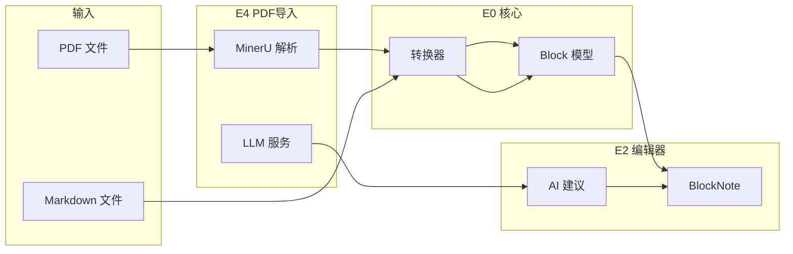
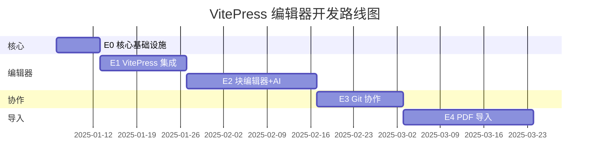

# VitePress 协作编辑器 - 开发计划

## 概述

本计划描述如何为「薪火笔记社协作编辑器」添加 VitePress 内容编辑功能。

**目标仓库**：[HIT-Fireworks/fireworks-notes-society](https://github.com/HIT-Fireworks/fireworks-notes-society)

**产品定位**：为非程序员用户提供类 Notion 的所见即所得编辑体验，同时支持 PDF 扫描件导入。

---

## 项目现状

已完成 **P0-P8 阶段**：

- ✅ Git 操作（Clone/Fetch/Push/Commit/Branch）
- ✅ 网络优化（自适应 TLS、IP 池、代理管理）
- ✅ 企业级凭证安全
- ✅ 团队协作工作区
- ✅ 可观测性

**待开发**：VitePress 内容编辑功能（E0-E4）

---

## 目标仓库结构分析

```
fireworks-notes-society/
├── .vitepress/
│   ├── config.mts          ← 站点配置（需解析）
│   └── theme/
├── lessons/
│   ├── 数学学院/
│   │   ├── index.md        ← 学院首页（标题来源）
│   │   ├── 数学分析/
│   │   │   ├── index.md    ← 课程首页
│   │   │   ├── 第一章.md
│   │   │   └── 第二章.md
│   │   └── 高等代数/
│   └── 计算机学院/
└── public/
```

**vitepress-sidebar 配置**：

```typescript
sidebar: generateSidebar([
  {
    resolvePath: "/",
    useFolderLinkFromIndexFile: true, // 文件夹链接到 index.md
    useFolderTitleFromIndexFile: true, // 标题从 index.md 提取
    useTitleFromFileHeading: true, // 文件标题从 # 标题提取
    excludePattern: ["parts", "team.md", "README.md"],
  },
]);
```

---

## 核心技术选型

| 需求               | 选型                                               | 理由                                    |
| ------------------ | -------------------------------------------------- | --------------------------------------- |
| **块编辑器**       | **BlockNote**                                      | 类 Notion，程序化 API (`replaceBlocks`) |
| **React-Vue 集成** | **[veaury](https://github.com/gloriasoft/veaury)** | 在 Vue 中使用 React 组件                |
| **AI 集成**        | **@blocknote/xl-ai**                               | 官方扩展，内置 Accept/Reject 建议 UI    |
| **Markdown**       | unified + remark                                   | AST 双向转换                            |
| **PDF 渲染**       | pdf.js                                             | Mozilla 官方                            |
| **PDF 解析**       | MinerU                                             | 结构化 JSON 输出，支持表格/公式         |

> **许可证**：`@blocknote/xl-ai` 使用 copyleft 许可证，开源项目可免费使用。

---

## React-Vue 集成方案

> BlockNote 是 React 组件，本项目使用 Vue，通过 **veaury** 实现集成。

### Vite 配置

```typescript
// vite.config.ts
import { defineConfig } from "vite";
import veauryVitePlugins from "veaury/vite/index.js";

export default defineConfig({
  plugins: [
    veauryVitePlugins({
      type: "custom",
      // .vue 文件和 vue&type=script 使用 Vue JSX
      vueJsxInclude: [/\.vue$/, /vue&type=script/],
      // 其他 .tsx 文件使用 React JSX
    }),
  ],
});
```

### 使用 React 组件

```vue
<script setup>
import { applyPureReactInVue } from "veaury";
import { BlockNoteView } from "@blocknote/mantine";
import "@blocknote/mantine/style.css";

// 将 React 组件转换为 Vue 组件
const BlockNoteEditor = applyPureReactInVue(BlockNoteView);
</script>

<template>
  <BlockNoteEditor :editor="editor" />
</template>
```

### 目录结构

```
src/components/editor/
├── BlockEditor.vue           ← Vue 包装器（使用 veaury）
└── react/                    ← React 组件子目录
    ├── ContainerBlock.tsx    VitePress 容器
    ├── MathBlock.tsx         公式块（KaTeX）
    └── MermaidBlock.tsx      Mermaid 预览
```

---

## AI 集成方案（定制化）

> **策略**：复用 `@blocknote/xl-ai` 的 **Accept/Reject 建议 UI**，自建 PDF 重解析逻辑。

### 复用官方部分

| 功能                     | 来源             | 说明                      |
| ------------------------ | ---------------- | ------------------------- |
| Accept/Reject 建议 UI    | @blocknote/xl-ai | 原内容删除线 + 新内容高亮 |
| 流式响应显示             | @blocknote/xl-ai | 用户体验                  |
| `editor.replaceBlocks()` | @blocknote/core  | 程序化替换内容            |

### 需自建模块

| 模块                | 说明                                        | 复杂度 |
| ------------------- | ------------------------------------------- | ------ |
| **PDF 区域裁剪**    | 根据 bbox 从 PDF 截取图片                   | 中     |
| **bbox 坐标映射**   | MinerU bbox → PDF 坐标 → Markdown 块        | 高     |
| **多模态 LLM 调用** | 裁剪图片 + 当前解析结果 → Qwen3-VL → 新解析 | 中     |
| **MinerU 块转换**   | MinerU JSON → BlockNote Block               | 中     |
| **高亮联动**        | Markdown 块选中 ↔ PDF 区域高亮             | 高     |
| **Image→Mermaid**   | 图片 → LLM 识别 → Mermaid 代码              | 中     |

### 调用流程

```typescript
// 1. 用户在 Markdown 中选中块
const selectedBlock = editor.getBlock(blockId);
const bbox = selectedBlock.source.bbox; // MinerU 提供的坐标

// 2. 根据 bbox 裁剪 PDF 图片（Tauri 后端）
const imageBase64 = await invoke("pdf_crop_region", {
  pdfPath,
  pageIndex: selectedBlock.source.pageIndex,
  bbox,
});

// 3. 调用多模态 LLM（自己的后端）
const newContent = await invoke("llm_reparse_region", {
  imageBase64,
  currentText: blockToMarkdown(selectedBlock),
  blockType: selectedBlock.type,
});

// 4. 使用 BlockNote AI 的建议模式显示 diff
// （复用官方 Accept/Reject UI）
editor.ai.showSuggestion({
  blockId,
  originalContent: selectedBlock.content,
  suggestedContent: markdownToBlocks(newContent),
});

// 5. 用户点击 Accept → 应用更改
editor.replaceBlocks([blockId], markdownToBlocks(newContent));
```

### LLM 调用设计

**原则**：

1. **任务明确**：根据用户操作确定具体任务，不让模型自己判断
2. **结构化输出**：使用 JSON Schema 确保输出格式可解析

#### 任务一：重解析文本块

```typescript
// 用户点击「重新解析」时调用
const reparseRequest = {
  model: "qwen-vl-max",
  messages: [
    {
      role: "user",
      content: [
        {
          type: "image_url",
          image_url: { url: `data:image/png;base64,${imageBase64}` },
        },
        {
          type: "text",
          text: `请根据图片内容，修正以下 OCR 解析结果中的错误：

【当前解析结果】
${currentText}

【块类型】
${blockType}  // 如 "paragraph"、"table"、"list"

【要求】
- 保持原有 Markdown 格式
- 修正错别字、漏字
- 修正表格对齐问题
- 不要添加解释`,
        },
      ],
    },
  ],
  response_format: {
    type: "json_schema",
    json_schema: {
      name: "reparse_result",
      schema: {
        type: "object",
        properties: {
          corrected_markdown: {
            type: "string",
            description: "修正后的 Markdown",
          },
          changes: {
            type: "array",
            items: { type: "string" },
            description: "修改说明",
          },
        },
        required: ["corrected_markdown"],
      },
    },
  },
};
```

#### 任务二：生成 Mermaid 图

```typescript
// 用户点击「生成 Mermaid」时调用
const mermaidRequest = {
  model: "qwen-vl-max",
  messages: [
    {
      role: "user",
      content: [
        {
          type: "image_url",
          image_url: { url: `data:image/png;base64,${imageBase64}` },
        },
        {
          type: "text",
          text: `请将图片中的图表转换为 Mermaid 代码。

【图表类型提示】
${diagramTypeHint}  // 如 "flowchart"、"sequence"、"classDiagram"

【要求】
- 输出可直接渲染的 Mermaid 代码
- 保持图表结构和文字内容`,
        },
      ],
    },
  ],
  response_format: {
    type: "json_schema",
    json_schema: {
      name: "mermaid_result",
      schema: {
        type: "object",
        properties: {
          mermaid_code: { type: "string", description: "Mermaid 图表代码" },
          diagram_type: {
            type: "string",
            enum: [
              "flowchart",
              "sequence",
              "classDiagram",
              "stateDiagram",
              "erDiagram",
              "gantt",
              "pie",
            ],
          },
        },
        required: ["mermaid_code", "diagram_type"],
      },
    },
  },
};
```

#### 响应解析

```typescript
interface ReparseResult {
  corrected_markdown: string;
  changes?: string[];
}

interface MermaidResult {
  mermaid_code: string;
  diagram_type: string;
}

// 解析响应
const result: ReparseResult = JSON.parse(response.choices[0].message.content);
```

---

## 开发阶段

### E0：核心基础设施（1 周）

**目标**：共享类型定义和 Markdown 转换器

**新增文件**：

```
src/
├── types/
│   ├── block.ts              块类型定义
│   └── document.ts           文档类型定义
└── utils/
    └── markdown-converter.ts  Markdown ↔ Block
```

**交付物**：

- [ ] Block 类型定义
- [ ] Markdown ↔ Block 双向转换

> **注**：MinerU JSON → Block 转换推迟到 E4 实现

---

### E1：VitePress 项目集成（2 周）

**目标**：解析 VitePress 配置，管理文档目录

**站点配置解析**：

| 字段          | 说明                                          |
| ------------- | --------------------------------------------- |
| `title`       | 站点标题                                      |
| `description` | 站点描述                                      |
| `nav`         | 导航栏配置                                    |
| `sidebar`     | 侧边栏配置（使用 vitepress-sidebar 生成规则） |
| `srcExclude`  | 排除文件                                      |
| `cleanUrls`   | 是否使用干净 URL                              |

**新增文件**：

```
src/
├── views/
│   └── DocumentView.vue              主视图
├── components/
│   └── document/
│       ├── DocumentTree.vue          目录树（按学院/课程/章节）
│       ├── DocumentTreeItem.vue      树节点
│       ├── DocumentBreadcrumb.vue    面包屑导航
│       ├── DocumentContextMenu.vue   右键菜单
│       └── SiteConfigPanel.vue       站点配置编辑
├── stores/
│   └── document.ts                   文档状态
└── api/
    └── vitepress.ts                  VitePress API 封装
```

**Tauri 后端命令**：

```rust
// src-tauri/src/app/commands/vitepress.rs
vitepress_detect_project(path: String) -> VitePressDetection
vitepress_parse_config(path: String) -> VitePressConfig
vitepress_get_doc_tree(path: String) -> DocTreeNode
vitepress_read_document(path: String) -> DocumentContent
vitepress_save_document(path: String, content: String) -> SaveResult
vitepress_create_document(dir: String, name: String) -> String
vitepress_create_folder(parent: String, name: String) -> String
vitepress_rename(old_path: String, new_name: String) -> String
vitepress_delete(path: String) -> bool
```

**交付物**：

- [ ] 解析 `.vitepress/config.mts`
- [ ] 目录树展示（学院 → 课程 → 章节）
- [ ] 文件 CRUD 操作
- [ ] Git 状态标记（已修改/已暂存/冲突）
- [ ] 智能标题提取（从 index.md 或 # 标题）

---

### E2：块编辑器（3 周）

> 详细计划请参考 [E2 细化路线图与开发计划](file:///c:/Users/34404/Documents/GitHub/fireworks-collaboration/doc/TECH_DESIGN_E2_PLAN.md)

**目标**：为非程序员用户提供所见即所得编辑体验

> BlockNote 本身就是所见即所得编辑器，无需单独的预览栏。

**用户友好设计**：

| 特性               | 说明                                      |
| ------------------ | ----------------------------------------- |
| `/` 命令           | 输入 `/` 快速插入标题、列表、代码、公式等 |
| 可视化工具栏       | 粗体/斜体/链接/图片等格式化按钮           |
| 块拖拽             | 拖拽调整内容顺序                          |
| 表单式 Frontmatter | 标题/描述/标签通过表单编辑，无需了解 YAML |

**块类型过滤**（仅保留可转换为 Markdown 的块）：

| 保留                                 | 屏蔽                             |
| ------------------------------------ | -------------------------------- |
| heading, paragraph                   | audio, video（无 Markdown 对应） |
| bulletListItem, numberedListItem     | file（使用链接代替）             |
| checkListItem, codeBlock             | 其他非标准块                     |
| table, image, quote                  |                                  |
| **自定义**：container, math, mermaid |                                  |

```typescript
// 自定义 BlockNote schema，仅包含支持 Markdown 的块
const schema = BlockNoteSchema.create({
  blockSpecs: {
    // 标准块
    paragraph: defaultBlockSpecs.paragraph,
    heading: defaultBlockSpecs.heading,
    bulletListItem: defaultBlockSpecs.bulletListItem,
    numberedListItem: defaultBlockSpecs.numberedListItem,
    checkListItem: defaultBlockSpecs.checkListItem,
    codeBlock: defaultBlockSpecs.codeBlock,
    table: defaultBlockSpecs.table,
    image: defaultBlockSpecs.image,
    // 自定义块
    container: ContainerBlock, // VitePress :::tip
    math: MathBlock, // LaTeX 公式
    mermaid: MermaidBlock, // Mermaid 图表
  },
});
```

**VitePress 特有功能**：

```
:::tip 提示
这是一个提示容器
:::
```

→ 可视化为带图标的绿色提示框，点击切换类型（tip/warning/danger/details）

**编辑器布局**：

```
┌──────────────────────────────────────────────┐
│  编辑器                    │  VitePress 预览  │
│  (BlockNote WYSIWYG)       │  (iframe/webview) │
│                            │                  │
│  📝 所见即所得编辑          │  🌐 真实渲染效果   │
└──────────────────────────────────────────────┘
```

**新增文件**：

```
src/
├── components/
│   └── editor/
│       ├── BlockEditor.vue           主编辑器（veaury 包装）
│       ├── EditorToolbar.vue         可视化工具栏
│       ├── BlockPicker.vue           / 命令块选择器
│       ├── FrontmatterPanel.vue      表单式元数据
│       ├── FormulaEditor.vue         LaTeX 公式编辑
│       ├── VitePressPreview.vue      VitePress 预览 iframe
│       └── react/                    React 组件子目录
│           ├── ContainerBlock.tsx    VitePress 容器
│           ├── MathBlock.tsx         公式块（KaTeX）
│           └── MermaidBlock.tsx      Mermaid 预览
└── utils/
    ├── blocknote-schema.ts           自定义 schema（过滤块类型）
    ├── blocknote-adapter.ts          BlockNote ↔ Block 适配
    ├── markdown-to-blocks.ts         Markdown → 编辑器块
    └── blocks-to-markdown.ts         编辑器块 → Markdown
```

**交付物**：

- [ ] BlockNote 集成（veaury）
- [ ] 块类型过滤（仅 Markdown 兼容块）
- [ ] VitePress 容器可视化 (:::tip, :::warning, :::danger, :::details)
- [ ] LaTeX 公式（KaTeX）
- [ ] 表单式 Frontmatter
- [ ] Mermaid 图表预览
- [ ] VitePress Dev Server 集成 + 预览 iframe
- [ ] 文件保存 → 预览自动刷新

> **注**：AI 辅助功能推迟到 E4；滚动同步推迟到 E5

---

### E3：Git 协作增强（2 周）

**目标**：简化提交流程，可视化冲突解决

**新增文件**：

```
src/
└── components/
    └── git/
        ├── CommitPanel.vue           提交面板
        └── ConflictResolver.vue      冲突解决
```

**交付物**：

- [ ] 一键提交 + 推送
- [ ] 可视化冲突解决

---

### E4：PDF 导入（3 周）

**目标**：从 PDF 扫描件创建文档，支持 LLM 辅助修正

**两栏布局**（导入模式）：

> BlockNote 本身是 WYSIWYG，无需单独的预览栏

```
┌─────────────────────────────────────────────────────────┐
│  PDF 导入编辑器                        [保存] [取消]     │
├──────────────────────────┬──────────────────────────────┤
│    📄 PDF 预览            │   📝 BlockNote 编辑器        │
│   （可框选区域/高亮）      │   （所见即所得）             │
│                          │                              │
│  [< 上一页] 1/5 [>]       │                              │
├──────────────────────────┴──────────────────────────────┤
│  [🔄 重新解析选中] [🎨 生成 Mermaid] [✓ 接受全部建议]    │
└─────────────────────────────────────────────────────────┘
```

**四种交互模式**：

#### 一、从 Markdown 更新解析

1. 用户在 Markdown 中选中文本块
2. 系统根据块的 `bbox` 在 PDF 中高亮对应区域
3. 点击「重新解析」调用多模态 LLM（Qwen3-VL）
4. BlockNote AI 显示 Accept/Reject 建议

#### 二、从 PDF 更新解析

1. 用户在 PDF 中框选区域
2. 系统根据框选 `bbox` 推断影响的 Markdown 块范围（IoU > 30%）
3. 调用多模态 LLM 重新解析
4. BlockNote AI 显示 Accept/Reject 建议

#### 三、Image → Mermaid 转换

- **触发方式 1**：Markdown 中 Image 块点击「生成 Mermaid」
- **触发方式 2**：PDF 中框选区域点击「生成 Mermaid」
- LLM 识别图片类型（流程图/时序图/等），生成对应 Mermaid 代码

#### 四、所有 AI 更改需确认

- 使用 BlockNote AI 的 Accept/Reject 建议 UI
- 原内容显示删除线，新内容高亮
- 可单条或批量接受/拒绝

### bbox 坐标映射算法

MinerU 输出的 bbox 格式：`[x1, y1, x2, y2]`（像素坐标）

```typescript
// src/utils/bbox-mapping.ts

interface BBox {
  x1: number;
  y1: number;
  x2: number;
  y2: number;
}

/**
 * 计算两个 bbox 的 IoU (Intersection over Union)
 */
function calculateIoU(a: BBox, b: BBox): number {
  const intersectX1 = Math.max(a.x1, b.x1);
  const intersectY1 = Math.max(a.y1, b.y1);
  const intersectX2 = Math.min(a.x2, b.x2);
  const intersectY2 = Math.min(a.y2, b.y2);

  if (intersectX2 <= intersectX1 || intersectY2 <= intersectY1) return 0;

  const intersectArea =
    (intersectX2 - intersectX1) * (intersectY2 - intersectY1);
  const aArea = (a.x2 - a.x1) * (a.y2 - a.y1);
  const bArea = (b.x2 - b.x1) * (b.y2 - b.y1);

  return intersectArea / (aArea + bArea - intersectArea);
}

/**
 * 从用户框选区域找出受影响的 Markdown 块
 */
function findAffectedBlocks(selection: BBox, blocks: Block[]): Block[] {
  return blocks.filter((block) => {
    if (!block.source?.bbox) return false;
    const overlap = calculateIoU(selection, arrayToBBox(block.source.bbox));
    return overlap > 0.3; // IoU 阈值 30%
  });
}
```

### 跨页表格检测

MinerU 输出中，跨页表格的第二页部分特征：

- `lines` 为空数组
- 存在 `lines_deleted: true` 属性

```typescript
// src/utils/mineru-converter.ts

function mergeAcrossPageTables(pages: PageInfo[]): Block[] {
  const blocks: Block[] = [];
  let pendingTable: Block | null = null;

  for (const page of pages) {
    for (const paraBlock of page.para_blocks) {
      if (paraBlock.type === "table") {
        const isTableContinuation =
          paraBlock.blocks?.[0]?.lines?.length === 0 &&
          paraBlock.blocks?.[0]?.lines_deleted === true;

        if (isTableContinuation && pendingTable) {
          // 合并到上一个表格
          mergeTableRows(pendingTable, paraBlock);
          continue;
        } else {
          if (pendingTable) blocks.push(pendingTable);
          pendingTable = convertToBlock(paraBlock, page.page_idx);
        }
      } else {
        if (pendingTable) {
          blocks.push(pendingTable);
          pendingTable = null;
        }
        blocks.push(convertToBlock(paraBlock, page.page_idx));
      }
    }
  }

  if (pendingTable) blocks.push(pendingTable);
  return blocks;
}
```

**新增文件**：

```
src/
├── views/
│   └── PdfImportView.vue             三栏布局主视图
├── components/
│   └── pdf-import/
│       ├── PdfViewer.vue             PDF 渲染（pdf.js）
│       ├── PdfRegionSelector.vue     区域框选（Canvas overlay）
│       ├── BlockHighlighter.vue      PDF↔Markdown 高亮联动
│       ├── MermaidGenerator.vue      Mermaid 生成工具
│       └── SuggestionPanel.vue       AI 建议确认面板
├── stores/
│   └── pdf-import.ts                 导入状态管理
└── utils/
    ├── bbox-mapping.ts               坐标映射与 IoU 计算
    ├── mineru-converter.ts           MinerU → Block（含跨页合并）
    └── pdf-region-capture.ts         PDF 区域截图
```

**Tauri 后端命令**：

```rust
// src-tauri/src/app/commands/pdf.rs

/// 调用 MinerU API 解析 PDF
#[tauri::command]
async fn mineru_parse_pdf(pdf_path: String) -> Result<MinerUResult, Error>

/// 从 PDF 裁剪指定区域图片（返回 Base64）
#[tauri::command]
async fn pdf_crop_region(
  pdf_path: String,
  page: u32,
  bbox: [f64; 4]
) -> Result<String, Error>

// src-tauri/src/app/commands/llm.rs

/// 多模态 LLM 重解析（图片 + 当前文本 → 修正后文本）
#[tauri::command]
async fn llm_reparse_region(
  image_base64: String,
  current_text: String,
  block_type: String
) -> Result<String, Error>

/// 图片 → Mermaid 代码
#[tauri::command]
async fn llm_generate_mermaid(image_base64: String) -> Result<String, Error>
```

**交付物**：

- [ ] MinerU JSON 解析（含跨页表格合并）
- [ ] bbox 坐标映射与 IoU 计算
- [ ] 三栏布局（PDF / Markdown / 预览）
- [ ] Markdown 选中 → PDF 高亮联动
- [ ] PDF 框选 → 推断受影响块 → LLM 重解析
- [ ] Image → Mermaid 转换
- [ ] 复用 BlockNote AI 的 Accept/Reject 建议 UI

---

### E5：滚动同步（可选，1 周）

**目标**：编辑器滚动 ↔ VitePress 预览滚动联动

> VitePress 预览已在 E2 实现，E5 专注于滚动同步。

**实现方式**：

```typescript
// 编辑器块 ID → 预览 DOM 元素映射
interface ScrollMapping {
  blockId: string;
  previewSelector: string; // 如 #heading-xxx
}

// 编辑器滚动 → 预览同步
editor.on("scroll", (visibleBlockId) => {
  const selector = mapping.get(visibleBlockId);
  previewIframe.contentWindow.postMessage({
    type: "scrollTo",
    selector,
  });
});
```

**交付物**：

- [ ] 编辑器块 ↔ 预览 DOM 映射
- [ ] 双向滚动同步

---

## 数据流



---

## 后端架构

```
src-tauri/src/app/
├── commands/
│   ├── llm.rs              LLM API 调用
│   ├── vitepress.rs        VitePress 操作
│   └── pdf.rs              PDF 裁剪与处理
└── services/
    └── ai_chat.rs          AI 对话服务
```

**LLM 路由示例**：

```rust
#[tauri::command]
async fn ai_chat(messages: Vec<Message>) -> Result<StreamResponse> {
    // 调用 Qwen/OpenAI API
}
```

---

## 时间线



**预计完成时间**：约 11 周

---

## MinerU 数据结构参考

```typescript
interface MinerUResult {
  pdf_info: PageInfo[];
}

interface PageInfo {
  page_idx: number;
  page_size: [number, number];
  para_blocks: Block[];
}

interface Block {
  type: "title" | "text" | "table" | "image" | "list";
  bbox: [number, number, number, number]; // [x1, y1, x2, y2]
  index: number;
  lines?: Line[];
  blocks?: Block[]; // list 嵌套
}

// 跨页表格：lines 为空 + lines_deleted: true
```

---

## 技术验证与风险分析

### ✅ 已验证可行

| 技术点                         | 验证结果                                              | 来源                                                                                 |
| ------------------------------ | ----------------------------------------------------- | ------------------------------------------------------------------------------------ |
| **BlockNote 自定义 Schema**    | ✅ 可通过 `BlockNoteSchema.create()` 过滤块类型       | [blocknotejs.org](https://www.blocknotejs.org/docs/editor-basics/document-structure) |
| **BlockNote AI 程序化触发**    | ✅ 使用 `editor.getExtension(AIExtension).invokeAI()` | [blocknotejs.org/docs/features/ai](https://www.blocknotejs.org/docs/features/ai)     |
| **BlockNote AI Accept/Reject** | ✅ `acceptChanges()` / `rejectChanges()` 方法         | BlockNote AI Extension API                                                           |
| **veaury React-Vue 集成**      | ✅ `applyPureReactInVue()` 可用                       | [github.com/gloriasoft/veaury](https://github.com/gloriasoft/veaury)                 |
| **Qwen VL 结构化输出**         | ✅ 支持 `response_format: { type: "json_schema" }`    | [aliyun.com 通义千问文档](https://help.aliyun.com/document_detail/2712555.html)      |
| **pdf.js 区域裁剪**            | ✅ 通过 `viewport.viewBox` 指定渲染区域               | [stackoverflow.com](https://stackoverflow.com/questions/tagged/pdf.js)               |

### ⚠️ 需要注意的风险

| 风险                            | 说明                                           | 缓解措施                                 |
| ------------------------------- | ---------------------------------------------- | ---------------------------------------- |
| **BlockNote Markdown 转换有损** | 官方文档明确指出转换是 "lossy"，表格可能有 bug | 详见下方「Markdown 转换策略」            |
| **veaury TypeScript JSX 冲突**  | Vue 和 React 的 JSX 类型冲突导致 IDE 警告      | 本项目不使用 Vue JSX，配置 tsconfig 即可 |
| **veaury + react-dom 19**       | 需要 `veaury@^2.6.0` 并手动配置 `createRoot`   | 检查 react-dom 版本，必要时锁定 18.x     |
| **VitePress iframe 安全限制**   | Tauri 中 iframe 无法访问 IPC，不推荐使用       | 改用 Tauri `WebView` API 或独立窗口      |
| **滚动同步复杂度高**            | 需要建立编辑器块 ↔ 渲染 DOM 的映射            | 推迟到 E5，作为可选功能                  |

### Markdown 转换策略

#### BlockNote → Markdown（导出）

| 块类型                         | 处理方式                                          |
| ------------------------------ | ------------------------------------------------- |
| heading, paragraph, list, code | 使用 BlockNote 自带转换                           |
| table                          | 使用自带转换，如有 bug 则输出 HTML `<table>` 格式 |
| image                          | 标准 Markdown ``                       |
| container (:::tip)             | 自定义转换为 `:::tip\n内容\n:::`                  |
| math                           | 自定义转换为 `$$公式$$`                           |
| mermaid                        | 自定义转换为 ` ```mermaid ` 代码块                |
| **vueComponent**               | 原样输出 `<OList path="..."/>`                    |
| **include**                    | 原样输出 `<!--@include: @/path-->`                |
| audio, video, file             | ❌ 已通过 schema 屏蔽，不会出现                   |

````typescript
// src/utils/blocks-to-markdown.ts
async function blocksToMarkdown(blocks: Block[]): Promise<string> {
  // 1. 先用 BlockNote 自带转换
  let md = await editor.blocksToMarkdown(blocks);

  // 2. 处理自定义块
  for (const block of blocks) {
    if (block.type === "container") {
      // :::tip 格式
    } else if (block.type === "math") {
      // $$ 格式
    } else if (block.type === "mermaid") {
      // ```mermaid 格式
    } else if (block.type === "vueComponent") {
      // 原样输出: <OList path="/数学学院/初等数论"/>
    } else if (block.type === "include") {
      // 原样输出: <!--@include: @/parts/wip.md-->
    }
  }
  return md;
}
````

#### Markdown → BlockNote（导入）

| Markdown 语法                  | 处理方式                                   |
| ------------------------------ | ------------------------------------------ |
| 标准 Markdown                  | 使用 BlockNote 自带转换                    |
| `:::tip` 容器                  | 自定义解析 → ContainerBlock                |
| `$$ $$` 公式                   | 自定义解析 → MathBlock                     |
| ` ```mermaid `                 | 自定义解析 → MermaidBlock                  |
| **`<OList .../>`** 等 Vue 组件 | 自定义解析 → VueComponentBlock（原样保留） |
| **`<!--@include: ...-->`**     | 自定义解析 → IncludeBlock（原样保留）      |
| HTML `<table>`                 | 转换为 BlockNote table 块                  |
| 未识别语法                     | 作为纯文本 paragraph                       |

```typescript
// src/utils/markdown-to-blocks.ts
import { unified } from "unified";
import remarkParse from "remark-parse";
import remarkDirective from "remark-directive";
import remarkMath from "remark-math";

function markdownToBlocks(md: string): Block[] {
  const ast = unified()
    .use(remarkParse)
    .use(remarkDirective) // 解析 :::tip
    .use(remarkMath) // 解析 $$
    .parse(md);

  return astToBlocks(ast);
}

// 识别 VitePress 自定义语法
function astToBlocks(ast: Node): Block[] {
  return ast.children.map((node) => {
    // Vue 组件: <OList path="..."/>
    if (
      node.type === "html" &&
      node.value.startsWith("<") &&
      !node.value.startsWith("<!--")
    ) {
      const parsed = parseVueComponent(node.value);
      return {
        type: "vueComponent",
        props: {
          componentName: parsed.name, // "OList"
          attributes: parsed.attrs, // { path: "/数学学院/初等数论" }
        },
      };
    }
    // 文件包含: <!--@include: @/path-->
    if (node.type === "html" && node.value.includes("@include:")) {
      const parsed = parseIncludeDirective(node.value);
      return {
        type: "include",
        props: {
          path: parsed.path, // "@/parts/wip.md"
          lineRange: parsed.lineRange, // { start: 1, end: 10 } 或 null
          region: parsed.region, // "regionName" 或 null
        },
      };
    }
    // ...其他节点处理
  });
}
```

#### VitePress 特有语法（可编辑）

##### Vue 组件块

**编辑器 UI**：

- 🧩 **组件选择器**：从项目 `.vitepress/theme/components/` 扫描可用组件
- 📝 **属性编辑表单**：根据组件 props 动态生成输入框

**组件约定**（使用 JSDoc 标准注释）：

```vue
<!-- .vitepress/theme/components/OList.vue -->
<script setup lang="ts">
/**
 * 文件列表组件
 * @public  ← 标记为可在编辑器中使用（没有此标记的组件会被隐藏）
 */

interface Props {
  /**
   * 文件目录路径
   * @description 相对于项目根目录的路径，如 "/数学学院/初等数论"
   */
  path: string;

  /**
   * 显示的最大文件数
   * @default 10
   */
  limit?: number;
}

defineProps<Props>();
</script>
```

**约定规则**：

| 标记            | 作用                                        |
| --------------- | ------------------------------------------- |
| `@public`       | 组件会出现在编辑器的组件选择器中            |
| `@internal`     | 组件被隐藏，不会出现在选择器中（默认行为）  |
| `@description`  | 属性说明，显示在编辑表单中                  |
| `@default`      | 默认值提示                                  |
| TypeScript 类型 | 自动推断输入框类型（string/number/boolean） |

**组件发现与解析**（使用 [vue-component-meta](https://github.com/vuejs/language-tools/tree/master/packages/component-meta)）：

```typescript
// src/utils/vitepress-components.ts
import { createComponentMetaChecker } from "vue-component-meta";

async function discoverVueComponents(
  projectPath: string
): Promise<ComponentInfo[]> {
  const checker = createComponentMetaChecker(
    path.join(projectPath, "tsconfig.json")
  );

  const componentsDir = path.join(projectPath, ".vitepress/theme/components");
  const files = await fs.readdir(componentsDir);

  const components: ComponentInfo[] = [];

  for (const file of files.filter((f) => f.endsWith(".vue"))) {
    const filePath = path.join(componentsDir, file);
    const meta = checker.getComponentMeta(filePath);

    // 检查是否有 @public 标记
    const isPublic = meta.description?.includes("@public");
    if (!isPublic) continue; // 跳过非公开组件

    components.push({
      name: file.replace(".vue", ""),
      description: meta.description?.replace("@public", "").trim(),
      props: meta.props.map((prop) => ({
        name: prop.name,
        type: prop.type,
        required: prop.required,
        default: prop.default,
        description: prop.description, // 来自 @description
      })),
    });
  }

  return components;
}
```

##### @include 指令块

**支持的语法**（来源：[VitePress 文档](https://vitepress.dev/guide/markdown#markdown-file-inclusion)）：

| 语法     | 示例                                    | 说明               |
| -------- | --------------------------------------- | ------------------ |
| 完整文件 | `<!--@include: ./file.md-->`            | 引用整个文件       |
| 源根路径 | `<!--@include: @/parts/wip.md-->`       | `@` 表示项目根目录 |
| 行范围   | `<!--@include: ./file.md{5-10}-->`      | 第 5-10 行         |
| 起始行   | `<!--@include: ./file.md{5-}-->`        | 从第 5 行到末尾    |
| 结束行   | `<!--@include: ./file.md{-10}-->`       | 从开头到第 10 行   |
| 区域     | `<!--@include: ./file.md#regionName-->` | 指定 `#region` 块  |

**编辑器 UI**：

- 📂 **文件选择器**：浏览项目 Markdown 文件
- 📏 **行范围输入**：可选的起止行号
- 🏷️ **区域选择**：解析目标文件的 `#region` 标记

```typescript
// src/components/editor/react/IncludeBlock.tsx
interface IncludeBlockProps {
  path: string;
  lineRange?: { start?: number; end?: number };
  region?: string;
}

// 生成 Markdown 输出
function toMarkdown(props: IncludeBlockProps): string {
  let result = `<!--@include: ${props.path}`;
  if (props.region) result += `#${props.region}`;
  if (props.lineRange) {
    const { start, end } = props.lineRange;
    result += `{${start ?? ""}-${end ?? ""}}`;
  }
  return result + "-->";
}
```

> **策略**：Vue 组件和 @include 指令在编辑器中**完全可编辑**，通过友好的 UI 引导用户插入和修改。

### veaury JSX 冲突缓解

由于本项目不使用 Vue JSX（仅使用 `.vue` SFC 模板），冲突影响极小。

**配置 tsconfig.json**：

```json
{
  "compilerOptions": {
    // React 组件放在 components/*/react 子目录
    "jsx": "react-jsx",
    "jsxImportSource": "react"
  },
  "include": ["src/components/**/react/**/*"]
}
```

**目录隔离**：

```
src/components/editor/
├── BlockEditor.vue           ← Vue SFC
├── EditorToolbar.vue         ← Vue SFC
└── react/                    ← React 组件子目录
    ├── ContainerBlock.tsx
    ├── MathBlock.tsx
    └── MermaidBlock.tsx
```

### 🔴 需要原型验证

| 技术点                            | 验证内容                          | 建议                             |
| --------------------------------- | --------------------------------- | -------------------------------- |
| **veaury + BlockNote 实际集成**   | 事件传递、状态同步是否正常        | E2 开始前做技术 spike            |
| **BlockNote AI 自定义 Transport** | 能否替换后端为 Tauri invoke       | 研究 `DefaultChatTransport` 源码 |
| **VitePress :::容器 转换**        | 自定义 MDAST 节点 ↔ BlockNote 块 | 使用 `remark-directive` 插件     |
| **pdf.js 大文件性能**             | 100+ 页 PDF 渲染性能              | 实现分页懒加载                   |

### 关键代码验证

#### 1. BlockNote AI 程序化调用（已验证）

```typescript
// 来源: blocknotejs.org/docs/features/ai
const aiExtension = editor.getExtension(AIExtension);

// 程序化触发 AI（不需要用户点击）
await aiExtension.invokeAI({
  userPrompt: "修正 OCR 错误",
  useSelection: true, // 使用当前选中内容
});

// 程序化接受/拒绝
aiExtension.acceptChanges();
aiExtension.rejectChanges();
```

#### 2. pdf.js 区域裁剪（已验证）

```typescript
// 来源: stackoverflow.com + pdf.js 文档
const page = await pdf.getPage(pageNumber);
const viewport = page.getViewport({ scale: 2.0 });

// 设置裁剪区域 [x, y, width, height]
viewport.viewBox = [bbox.x1, bbox.y1, bbox.x2 - bbox.x1, bbox.y2 - bbox.y1];

// 调整 canvas 尺寸
canvas.width = viewport.width;
canvas.height = viewport.height;

await page.render({ canvasContext: ctx, viewport }).promise;
```

#### 3. VitePress 容器解析（需验证）

```typescript
// 使用 remark-directive 解析 VitePress 容器语法
import { unified } from "unified";
import remarkParse from "remark-parse";
import remarkDirective from "remark-directive";

const processor = unified()
  .use(remarkParse)
  .use(remarkDirective)
  .use(() => (tree) => {
    // :::tip → containerDirective { name: 'tip' }
    visit(tree, "containerDirective", (node) => {
      if (node.name === "tip") {
        // 转换为 BlockNote 自定义块
      }
    });
  });
```

---

## 参考资源

- [BlockNote 文档](https://www.blocknotejs.org/docs)
- [BlockNote AI](https://www.blocknotejs.org/docs/features/ai)
- [BlockNote Custom Blocks](https://www.blocknotejs.org/docs/editor-basics/custom-blocks)
- [veaury GitHub](https://github.com/gloriasoft/veaury)
- [MinerU 项目](https://github.com/opendatalab/MinerU)
- [Vercel AI SDK](https://ai-sdk.dev)
- [pdf.js 文档](https://mozilla.github.io/pdf.js/)
- [remark-directive](https://github.com/remarkjs/remark-directive)
- [Qwen VL 结构化输出](https://help.aliyun.com/document_detail/2712555.html)
- [vue-component-meta](https://github.com/vuejs/language-tools/tree/master/packages/component-meta)

---

## MinerU 示例文件

以下示例文件展示了 MinerU 的输出格式，可用于开发和测试：

| 文件                                                       | 说明                                 |
| ---------------------------------------------------------- | ------------------------------------ |
| [MinerU_Example.json](./MinerU_Example.json)               | MinerU JSON 输出示例 1               |
| [MinerU_Example_2.json](./MinerU_Example_2.json)           | MinerU JSON 输出示例 2（含跨页表格） |
| [MinerU_markdown_Example.md](./MinerU_markdown_Example.md) | MinerU 生成的 Markdown 示例          |
