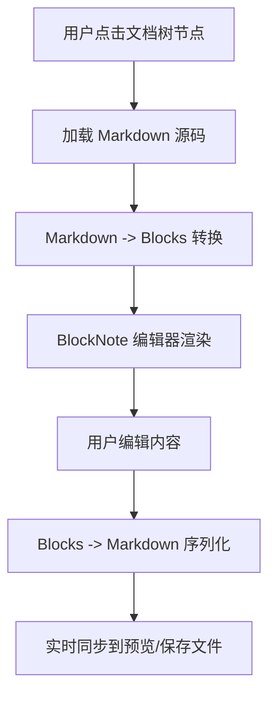

# E2 阶段细化路线图与开发计划（块编辑器集成）

> 本文档将 E2 阶段「块编辑器集成」拆解为可执行的任务清单，实现基于 BlockNote 的所见即所得 (WYSIWYG) 编辑体验，支持 VitePress 特有语法（容器、公式、图表、Vue 组件）的可视化编辑。

---

## 0. 目标、范围与成功标准

### 目标

- 集成 **BlockNote** 编辑器到 `DocumentView` 中。
- 实现 React 组件在 Vue 环境下的高效运行（通过 `veaury`）。
- 定义符合 VitePress 语法的自定义块（Blocks）。
- 提供表单化的 Frontmatter 编辑面板。
- 实现 Markdown 源码与块编辑器的高性能双向同步。

### 使用流程



### 范围

**包含（E2）**

| 模块                 | 说明                                                         |
| -------------------- | ------------------------------------------------------------ |
| **React-Vue 集成**   | 配置 `veaury` 环境，确保 BlockNote 正常渲染                  |
| **自定义 Schema**    | 扩展 BlockNote 支持 VitePress 容器、公式、Mermaid            |
| **VitePress 扩展块** | 实现 Vue 组件块（VueComponentBlock）和包含块（IncludeBlock） |
| **可视化工具栏**     | 适配 DaisyUI 风格的悬浮工具栏和斜杠菜单                      |
| **Frontmatter 面板** | 表单化编辑文档标题、描述、布局等元数据                       |
| **数据同步机制**     | 处理编辑器状态变更与 Markdown 源码的实时/防抖同步            |

**不包含（推迟）**

| 模块                | 推迟至   |
| ------------------- | -------- |
| Git 冲突可视化解决  | E3       |
| PDF 导入与 OCR 联动 | E4       |
| 多端协同编辑        | 未来规划 |

### 成功标准

1. 文档能在 BlockNote 中正常加载并保留所有格式。
2. 支持创建和编辑 `:::tip` 等 VitePress 容器，且有对应的 UI 样式。
3. LaTeX 公式和 Mermaid 图表能实时预览。
4. Vue 组件（如 `<OList />`）和 `<!--@include: ...-->` 能以块形式展示并编辑属性。
5. 编辑器保存后，Markdown 源码与原文件保持高度一致（最小化格式损耗）。

---

## 1. 技术方案设计

### 1.1 架构设计

#### A. 混合框架集成 (Veaury)

本项目主体为 Vue 3，BlockNote 为 React 组件。使用 `veaury` 进行包装：

- `src/components/editor/react/`：存放所有 React 实现的编辑器组件和自定义块。
- `src/components/editor/BlockEditor.vue`：Vue 包装器组件。

#### B. 状态管理 (Pinia)

`documentStore` 将扩展以下状态：

- `editorInstance`：BlockNote 编辑器实例引用。
- `isDirty`：是否有未保存的更改。
- `editorMode`：编辑模式（WYSIWYG 模式 / 源码模式备份）。

### 1.2 块系统 (Schema)

自定义 Schema 将过滤掉不支持 Markdown 转换的块类型（如 Audio/Video），并新增：

| 块名           | Markdown 映射               |
| -------------- | --------------------------- |
| `container`    | `:::tip` / `:::warning` ... |
| `math`         | `$$ ... $$`                 |
| `mermaid`      | ` ```mermaid ... ``` `      |
| `vueComponent` | `<ComponentName props />`   |
| `include`      | `<!--@include: ...-->`      |

### 1.3 数据转换增强

在 E0 产出的转换器基础上，增加对 BlockNote 内部结构的适配：

- **BlockNote JSON -> Block Model**：中间层适配。
- **Block Model -> BlockNote JSON**：用于文档加载。

---

## 2. E2 分阶段与任务清单

### E2.1 环境搭建与基础设施（约 3 天）

**范围**：

- 安装并配置 React-Vue 混合开发环境
- 完成 BlockNote 基础集成
- 验证编辑器能在 DocumentView 中正常渲染

**交付物**：

- [ ] package.json 依赖配置完成
- [ ] vite.config.ts veaury 插件配置
- [ ] tsconfig.json JSX 类型隔离
- [ ] BlockEditor.vue 基础组件
- [ ] 在 DocumentView 中成功挂载编辑器

**依赖版本要求**：

```json
{
  "dependencies": {
    "@blocknote/core": "^0.15.0",
    "@blocknote/mantine": "^0.15.0",
    "@blocknote/react": "^0.15.0",
    "react": "^18.3.1",
    "react-dom": "^18.3.1",
    "veaury": "^2.6.0",
    "@mantine/core": "^7.0.0",
    "@mantine/hooks": "^7.0.0",
    "katex": "^0.16.9",
    "mermaid": "^10.6.1"
  },
  "devDependencies": {
    "@types/react": "^18.3.0",
    "@types/react-dom": "^18.3.0",
    "@types/katex": "^0.16.7"
  }
}
```

**Vite 配置**：

```typescript
// vite.config.ts
import { defineConfig } from "vite";
import vue from "@vitejs/plugin-vue";
import veauryVitePlugins from "veaury/vite/index.js";

export default defineConfig({
  plugins: [
    vue(),
    veauryVitePlugins({
      type: "custom",
      // .vue 文件使用 Vue JSX
      vueJsxInclude: [/\.vue$/, /vue&type=script/],
      // src/components/editor/react/ 下的 .tsx 使用 React JSX
      reactInclude: [/\/editor\/react\/.*\.tsx$/],
    }),
  ],
  resolve: {
    alias: {
      "@": "/src",
    },
  },
});
```

**TypeScript 配置**：

```json
// tsconfig.json
{
  "compilerOptions": {
    "jsx": "preserve",
    "jsxImportSource": "vue"
  },
  "include": ["src/**/*.ts", "src/**/*.vue"],
  "exclude": ["src/components/editor/react/**/*"]
}
```

```json
// tsconfig.react.json (React 组件专用)
{
  "extends": "./tsconfig.json",
  "compilerOptions": {
    "jsx": "react-jsx",
    "jsxImportSource": "react"
  },
  "include": ["src/components/editor/react/**/*"]
}
```

**基础编辑器组件**：

```vue
<!-- src/components/editor/BlockEditor.vue -->
<script setup lang="ts">
import { ref, onMounted, watch } from "vue";
import { applyPureReactInVue } from "veaury";
import { BlockNoteView } from "@blocknote/mantine";
import { useCreateBlockNote } from "@blocknote/react";
import "@blocknote/mantine/style.css";
import type { Block } from "@/types/block";

interface Props {
  initialContent?: Block[];
  editable?: boolean;
}

const props = withDefaults(defineProps<Props>(), {
  editable: true,
});

const emit = defineEmits<{
  change: [blocks: Block[]];
  ready: [];
}>();

// 将 React 组件包装为 Vue 组件
const BlockNoteEditor = applyPureReactInVue(BlockNoteView);

// 编辑器配置将在 E2.3 完善
const editorConfig = {
  // 暂时使用默认配置
};

onMounted(() => {
  emit("ready");
});
</script>

<template>
  <div class="block-editor-container">
    <BlockNoteEditor :editor="editorConfig" :editable="editable" />
  </div>
</template>

<style scoped>
.block-editor-container {
  @apply w-full h-full overflow-auto;
}
</style>
```

**在 DocumentView 中集成**：

```vue
<!-- src/views/DocumentView.vue (部分代码) -->
<script setup lang="ts">
import BlockEditor from "@/components/editor/BlockEditor.vue";
import { useDocumentStore } from "@/stores/document";

const docStore = useDocumentStore();

const handleEditorReady = () => {
  console.log("编辑器已就绪");
};

const handleEditorChange = (blocks: Block[]) => {
  docStore.markAsDirty();
};
</script>

<template>
  <div class="document-view">
    <!-- 左侧文档树 -->
    <aside class="sidebar">
      <DocumentTree />
    </aside>

    <!-- 中间编辑器 -->
    <main class="editor-pane">
      <BlockEditor
        v-if="docStore.currentDocument"
        :initial-content="docStore.currentDocument.blocks"
        @ready="handleEditorReady"
        @change="handleEditorChange"
      />
    </main>

    <!-- 右侧预览 -->
    <aside v-if="docStore.devServer" class="preview-pane">
      <!-- VitePress 预览 iframe -->
    </aside>
  </div>
</template>
```

**验证清单**：

- [ ] 运行 `pnpm install` 无报错
- [ ] `pnpm dev` 启动成功
- [ ] 在 DocumentView 中能看到 BlockNote 编辑器
- [ ] 控制台无 React/Vue JSX 类型冲突警告
- [ ] 编辑器可输入文本（使用默认块类型）

### E2.2 核心内容读写同步（约 4 天）

**范围**：

- 实现 **Internal Block Model ↔ BlockNote JSON** 的双向适配器。
- 复用 E0 阶段已完成的 `markdownToBlocks` 和 `blocksToMarkdown` 转换逻辑。
- 确保 VitePress 扩展语法（容器、公式等）在适配过程中不丢失。
- 集成到 `documentStore` 流程中，实现自动化读写同步。

**数据流架构**：

1. **加载流程**：
   - 调用 `vitepress_read_document` 获取 Markdown 字符串。
   - 使用 E0 `markdownToBlocks` 解析为 `Internal Block[]`。
   - 通过 `internalToBlockNote` 适配器转换为 BlockNote 渲染格式。
2. **保存流程**：
   - 获取编辑器当前的 `BlockNote Block[]`。
   - 通过 `blockNoteToInternal` 适配器转换为 `Internal Block[]`。
   - 使用 E0 `blocksToMarkdown` 序列化为 Markdown 字符串。
   - 调用 `vitepress_save_document` 写入文件。

**交付物**：

- [ ] `src/utils/blocknote-adapter.ts` 完成双向转换函数。
- [ ] `documentStore` 对接适配器，实现 `loadDocumentToEditor` 和 `saveEditorToFile`。
- [ ] 针对 VitePress 扩展块的适配逻辑单元测试。
- [ ] 防抖保存逻辑。

**适配器设计细节**：

```typescript
// src/utils/blocknote-adapter.ts

import type { Block as BlockNoteBlock } from "@blocknote/core";
import type { Block as InternalBlock } from "@/types/block";

/**
 * 核心：Internal Block -> BlockNote JSON
 * 这里的 type 必须与 E2.3/E2.4 中定义的 customSchema 匹配
 */
export function internalToBlockNote(blocks: InternalBlock[]): BlockNoteBlock[] {
  return blocks.map((block) => {
    const common = { id: block.id };

    switch (block.type) {
      case "paragraph":
        return {
          ...common,
          type: "paragraph",
          content: block.content,
          children: [],
        };
      case "heading":
        return {
          ...common,
          type: "heading",
          props: { level: block.props.level },
          content: block.content,
          children: [],
        };
      case "container":
        return {
          ...common,
          type: "container",
          props: {
            containerType: block.props.containerType,
            title: block.props.title || "",
          },
          content: [],
          children: internalToBlockNote(block.children || []),
        };
      // ... 更多映射
      default:
        // 后备处理：将未识别块转为代码块显示
        return {
          ...common,
          type: "codeBlock",
          props: { code: JSON.stringify(block), language: "json" },
          content: [],
          children: [],
        };
    }
  }) as any;
}

/**
 * 核心：BlockNote JSON -> Internal Block
 */
export function blockNoteToInternal(blocks: BlockNoteBlock[]): InternalBlock[] {
  // 逆向逻辑实现...
  return [];
}
```

---

### E2.3 自定义块开发 - 基础组件（约 4 天）

**范围**：

- 实现 VitePress 容器块（:::tip/warning/danger/details）
- 实现数学公式块（KaTeX 集成）
- 实现 Mermaid 图表块

**交付物**：

- [ ] ContainerBlock React 组件及 BlockNote Schema
- [ ] MathBlock React 组件及 BlockNote Schema
- [ ] MermaidBlock React 组件及 BlockNote Schema
- [ ] 自定义块样式适配（DaisyUI 主题）

**ContainerBlock 实现**：

```tsx
// src/components/editor/react/ContainerBlock.tsx

import { createReactBlockSpec } from "@blocknote/react";
import { useState } from "react";
import "./ContainerBlock.css";

interface ContainerBlockProps {
  containerType: "tip" | "warning" | "danger" | "details";
  title?: string;
}

export const ContainerBlock = createReactBlockSpec(
  {
    type: "container",
    propSchema: {
      containerType: {
        default: "tip" as const,
        values: ["tip", "warning", "danger", "details"] as const,
      },
      title: {
        default: "",
      },
    },
    content: "inline",
  },
  {
    render: (props) => {
      const { containerType, title } = props.block.props;
      const [isOpen, setIsOpen] = useState(containerType !== "details");

      const icons = {
        tip: "💡",
        warning: "⚠️",
        danger: "🚨",
        details: "📋",
      };

      const classNames = {
        tip: "alert alert-info",
        warning: "alert alert-warning",
        danger: "alert alert-error",
        details: "collapse collapse-arrow",
      };

      return (
        <div className={`bn-container ${classNames[containerType]}`}>
          <div className="flex items-center gap-2">
            <span>{icons[containerType]}</span>
            {title && <strong>{title}</strong>}
            {containerType === "details" && (
              <button
                onClick={() => setIsOpen(!isOpen)}
                className="btn btn-xs btn-ghost ml-auto"
              >
                {isOpen ? "折叠" : "展开"}
              </button>
            )}
          </div>
          {(isOpen || containerType !== "details") && (
            <div className="mt-2" ref={props.contentRef} />
          )}
        </div>
      );
    },

    // 自定义斜杠菜单项
    slashCommand: {
      name: "VitePress 容器",
      group: "VitePress",
      hints: ["tip", "warning", "danger"],
      execute: (editor) => {
        editor.insertBlocks(
          [{ type: "container", props: { containerType: "tip" } }],
          editor.getTextCursorPosition().block,
          "after"
        );
      },
    },
  }
);
```

**MathBlock 实现**：

```tsx
// src/components/editor/react/MathBlock.tsx

import { createReactBlockSpec } from "@blocknote/react";
import { useState, useEffect } from "react";
import katex from "katex";
import "katex/dist/katex.min.css";

export const MathBlock = createReactBlockSpec(
  {
    type: "math",
    propSchema: {
      formula: {
        default: "",
      },
      displayMode: {
        default: true, // 块级公式
      },
    },
    content: "none",
  },
  {
    render: (props) => {
      const { formula, displayMode } = props.block.props;
      const [isEditing, setIsEditing] = useState(false);
      const [html, setHtml] = useState("");

      useEffect(() => {
        if (!formula) return;
        try {
          const rendered = katex.renderToString(formula, {
            displayMode,
            throwOnError: false,
          });
          setHtml(rendered);
        } catch (e) {
          setHtml(`<span class="text-error">LaTeX 错误: ${e.message}</span>`);
        }
      }, [formula, displayMode]);

      if (isEditing) {
        return (
          <div className="math-editor">
            <textarea
              className="textarea textarea-bordered w-full font-mono"
              value={formula}
              onChange={(e) =>
                props.editor.updateBlock(props.block, {
                  props: { formula: e.target.value },
                })
              }
              onBlur={() => setIsEditing(false)}
              placeholder="输入 LaTeX 公式..."
              autoFocus
            />
          </div>
        );
      }

      return (
        <div
          className="math-preview cursor-pointer hover:bg-base-200 p-2 rounded"
          onClick={() => setIsEditing(true)}
          dangerouslySetInnerHTML={{ __html: html || "点击编辑公式" }}
        />
      );
    },

    slashCommand: {
      name: "LaTeX 公式",
      group: "VitePress",
      execute: (editor) => {
        editor.insertBlocks(
          [{ type: "math", props: { formula: "" } }],
          editor.getTextCursorPosition().block,
          "after"
        );
      },
    },
  }
);
```

**MermaidBlock 实现**：

```tsx
// src/components/editor/react/MermaidBlock.tsx

import { createReactBlockSpec } from "@blocknote/react";
import { useState, useEffect, useRef } from "react";
import mermaid from "mermaid";

mermaid.initialize({
  startOnLoad: false,
  theme: "default",
});

export const MermaidBlock = createReactBlockSpec(
  {
    type: "mermaid",
    propSchema: {
      code: {
        default: "graph TD\n  A[开始] --> B[结束]",
      },
    },
    content: "none",
  },
  {
    render: (props) => {
      const { code } = props.block.props;
      const [isEditing, setIsEditing] = useState(false);
      const [svg, setSvg] = useState("");
      const containerRef = useRef<HTMLDivElement>(null);

      useEffect(() => {
        if (!code || isEditing) return;

        const renderDiagram = async () => {
          try {
            const { svg } = await mermaid.render(
              `mermaid-${props.block.id}`,
              code
            );
            setSvg(svg);
          } catch (e) {
            setSvg(`<div class="alert alert-error">Mermaid 语法错误</div>`);
          }
        };

        renderDiagram();
      }, [code, isEditing]);

      if (isEditing) {
        return (
          <div className="flex gap-2">
            <textarea
              className="textarea textarea-bordered flex-1 font-mono text-sm"
              value={code}
              onChange={(e) =>
                props.editor.updateBlock(props.block, {
                  props: { code: e.target.value },
                })
              }
              rows={10}
            />
            <button
              className="btn btn-primary btn-sm"
              onClick={() => setIsEditing(false)}
            >
              预览
            </button>
          </div>
        );
      }

      return (
        <div
          ref={containerRef}
          className="mermaid-preview cursor-pointer hover:bg-base-200 p-4 rounded"
          onClick={() => setIsEditing(true)}
          dangerouslySetInnerHTML={{ __html: svg }}
        />
      );
    },

    slashCommand: {
      name: "Mermaid 图表",
      group: "VitePress",
      execute: (editor) => {
        editor.insertBlocks(
          [{ type: "mermaid", props: { code: "graph TD\n  A --> B" } }],
          editor.getTextCursorPosition().block,
          "after"
        );
      },
    },
  }
);
```

**Schema 注册**：

```tsx
// src/components/editor/react/schema.ts

import { BlockNoteSchema, defaultBlockSpecs } from "@blocknote/core";
import { ContainerBlock } from "./ContainerBlock";
import { MathBlock } from "./MathBlock";
import { MermaidBlock } from "./MermaidBlock";

// 创建自定义 Schema
export const customSchema = BlockNoteSchema.create({
  blockSpecs: {
    // 保留标准块
    paragraph: defaultBlockSpecs.paragraph,
    heading: defaultBlockSpecs.heading,
    bulletListItem: defaultBlockSpecs.bulletListItem,
    numberedListItem: defaultBlockSpecs.numberedListItem,
    checkListItem: defaultBlockSpecs.checkListItem,
    codeBlock: defaultBlockSpecs.codeBlock,
    table: defaultBlockSpecs.table,
    image: defaultBlockSpecs.image,

    // 新增自定义块
    container: ContainerBlock,
    math: MathBlock,
    mermaid: MermaidBlock,

    // 屏蔽不支持的块
    // audio: undefined,
    // video: undefined,
    // file: undefined
  },
});

export type CustomSchema = typeof customSchema;
```

---

### E2.4 自定义块开发 - VitePress 特色语法（约 4 天）

**范围**：

- 实现 Vue 组件块（`<OList />` 等）
- 实现文件包含块（`<!--@include: ...-->`）
- 实现组件/文件选择器 UI

**交付物**：

- [ ] VueComponentBlock React 组件
- [ ] IncludeBlock React 组件
- [ ] 组件扫描与元数据提取工具
- [ ] 文件浏览器组件

**VueComponentBlock 实现**：

```tsx
// src/components/editor/react/VueComponentBlock.tsx

import { createReactBlockSpec } from "@blocknote/react";
import { useState } from "react";

interface ComponentInfo {
  name: string;
  description?: string;
  props: Array<{
    name: string;
    type: string;
    required: boolean;
    default?: any;
  }>;
}

export const VueComponentBlock = createReactBlockSpec(
  {
    type: "vueComponent",
    propSchema: {
      componentName: {
        default: "",
      },
      attributes: {
        default: {} as Record<string, any>,
      },
    },
    content: "none",
  },
  {
    render: (props) => {
      const { componentName, attributes } = props.block.props;
      const [isEditing, setIsEditing] = useState(!componentName);

      // 从项目扫描的组件列表
      const [availableComponents, setAvailableComponents] = useState<
        ComponentInfo[]
      >([]);

      useEffect(() => {
        // 调用 Tauri 命令扫描组件
        invoke<ComponentInfo[]>("vitepress_scan_components").then(
          setAvailableComponents
        );
      }, []);

      if (isEditing) {
        return (
          <div className="card bg-base-200 p-4">
            <h4 className="font-bold mb-2">插入 Vue 组件</h4>

            <select
              className="select select-bordered w-full mb-2"
              value={componentName}
              onChange={(e) =>
                props.editor.updateBlock(props.block, {
                  props: { componentName: e.target.value, attributes: {} },
                })
              }
            >
              <option value="">选择组件...</option>
              {availableComponents.map((comp) => (
                <option key={comp.name} value={comp.name}>
                  {comp.name} {comp.description && `- ${comp.description}`}
                </option>
              ))}
            </select>

            {componentName && (
              <div className="space-y-2">
                <h5 className="font-semibold">属性</h5>
                {availableComponents
                  .find((c) => c.name === componentName)
                  ?.props.map((prop) => (
                    <div key={prop.name} className="form-control">
                      <label className="label">
                        <span className="label-text">
                          {prop.name}
                          {prop.required && (
                            <span className="text-error">*</span>
                          )}
                        </span>
                      </label>
                      <input
                        type={prop.type === "number" ? "number" : "text"}
                        className="input input-bordered input-sm"
                        value={attributes[prop.name] || ""}
                        onChange={(e) =>
                          props.editor.updateBlock(props.block, {
                            props: {
                              attributes: {
                                ...attributes,
                                [prop.name]: e.target.value,
                              },
                            },
                          })
                        }
                        placeholder={prop.default?.toString()}
                      />
                    </div>
                  ))}

                <button
                  className="btn btn-primary btn-sm"
                  onClick={() => setIsEditing(false)}
                >
                  完成
                </button>
              </div>
            )}
          </div>
        );
      }

      // 预览模式
      const attrsString = Object.entries(attributes)
        .map(([key, value]) => `${key}="${value}"`)
        .join(" ");

      return (
        <div
          className="alert alert-info cursor-pointer"
          onClick={() => setIsEditing(true)}
        >
          <div className="font-mono text-sm">
            &lt;{componentName} {attrsString} /&gt;
          </div>
        </div>
      );
    },

    toMarkdown: (block) => {
      const { componentName, attributes } = block.props;
      const attrs = Object.entries(attributes)
        .map(([k, v]) => `${k}="${v}"`)
        .join(" ");
      return `<${componentName} ${attrs} />`;
    },

    slashCommand: {
      name: "Vue 组件",
      group: "VitePress",
      execute: (editor) => {
        editor.insertBlocks(
          [{ type: "vueComponent" }],
          editor.getTextCursorPosition().block,
          "after"
        );
      },
    },
  }
);
```

**IncludeBlock 实现**：

```tsx
// src/components/editor/react/IncludeBlock.tsx

import { createReactBlockSpec } from "@blocknote/react";
import { useState, useEffect } from "react";

export const IncludeBlock = createReactBlockSpec(
  {
    type: "include",
    propSchema: {
      path: {
        default: "",
      },
      lineStart: {
        default: undefined as number | undefined,
      },
      lineEnd: {
        default: undefined as number | undefined,
      },
      region: {
        default: undefined as string | undefined,
      },
    },
    content: "none",
  },
  {
    render: (props) => {
      const { path, lineStart, lineEnd, region } = props.block.props;
      const [isEditing, setIsEditing] = useState(!path);
      const [preview, setPreview] = useState("");

      useEffect(() => {
        if (!path) return;
        // 获取文件预览
        invoke<string>("vitepress_read_document", { path }).then((content) => {
          let lines = content.split("\n");
          if (lineStart !== undefined || lineEnd !== undefined) {
            lines = lines.slice((lineStart || 1) - 1, lineEnd);
          }
          setPreview(lines.slice(0, 5).join("\n") + "\n...");
        });
      }, [path, lineStart, lineEnd]);

      if (isEditing) {
        return (
          <div className="card bg-base-200 p-4">
            <h4 className="font-bold mb-2">包含文件</h4>

            {/* 文件选择器 */}
            <button
              className="btn btn-outline btn-sm mb-2"
              onClick={async () => {
                const selected = await invoke<string>("file_picker", {
                  defaultPath: path,
                });
                if (selected) {
                  props.editor.updateBlock(props.block, {
                    props: { path: selected },
                  });
                }
              }}
            >
              选择文件: {path || "未选择"}
            </button>

            {/* 行范围 */}
            <div className="flex gap-2">
              <input
                type="number"
                className="input input-bordered input-sm"
                placeholder="起始行"
                value={lineStart || ""}
                onChange={(e) =>
                  props.editor.updateBlock(props.block, {
                    props: {
                      lineStart: e.target.value
                        ? parseInt(e.target.value)
                        : undefined,
                    },
                  })
                }
              />
              <input
                type="number"
                className="input input-bordered input-sm"
                placeholder="结束行"
                value={lineEnd || ""}
                onChange={(e) =>
                  props.editor.updateBlock(props.block, {
                    props: {
                      lineEnd: e.target.value
                        ? parseInt(e.target.value)
                        : undefined,
                    },
                  })
                }
              />
            </div>

            {/* 区域名称 */}
            <input
              type="text"
              className="input input-bordered input-sm mt-2"
              placeholder="#region 名称（可选）"
              value={region || ""}
              onChange={(e) =>
                props.editor.updateBlock(props.block, {
                  props: { region: e.target.value || undefined },
                })
              }
            />

            <button
              className="btn btn-primary btn-sm mt-2"
              onClick={() => setIsEditing(false)}
              disabled={!path}
            >
              完成
            </button>
          </div>
        );
      }

      return (
        <div
          className="alert cursor-pointer"
          onClick={() => setIsEditing(true)}
        >
          <div>
            <div className="font-mono text-xs">
              @include: {path}
              {lineStart !== undefined &&
                `{${lineStart || ""}-${lineEnd || ""}}`}
              {region && `#${region}`}
            </div>
            {preview && (
              <pre className="text-xs mt-2 opacity-60">{preview}</pre>
            )}
          </div>
        </div>
      );
    },

    toMarkdown: (block) => {
      const { path, lineStart, lineEnd, region } = block.props;
      let result = `<!--@include: ${path}`;
      if (region) result += `#${region}`;
      if (lineStart !== undefined || lineEnd !== undefined) {
        result += `{${lineStart || ""}-${lineEnd || ""}}`;
      }
      return result + "-->";
    },

    slashCommand: {
      name: "包含文件",
      group: "VitePress",
      execute: (editor) => {
        editor.insertBlocks(
          [{ type: "include" }],
          editor.getTextCursorPosition().block,
          "after"
        );
      },
    },
  }
);
```

**Tauri 后端命令**：

```rust
// src-tauri/src/app/commands/vitepress.rs (新增)

use serde::{Deserialize, Serialize};

#[derive(Serialize)]
pub struct ComponentInfo {
    name: String,
    description: Option<String>,
    props: Vec<PropInfo>,
}

#[derive(Serialize)]
pub struct PropInfo {
    name: String,
    prop_type: String,
    required: bool,
    default_value: Option<String>,
}

/// 扫描项目中的 Vue 组件（标记为 @public 的）
#[tauri::command]
pub async fn vitepress_scan_components(
    project_path: String
) -> Result<Vec<ComponentInfo>, Error> {
    let components_dir = PathBuf::from(&project_path)
        .join(".vitepress/theme/components");

    if !components_dir.exists() {
        return Ok(vec![]);
    }

    // 使用 vue-component-meta 或简单的正则解析
    // 这里简化为文件列表扫描
    let mut components = vec![];

    for entry in std::fs::read_dir(components_dir)? {
        let path = entry?.path();
        if path.extension().and_then(|s| s.to_str()) == Some("vue") {
            let content = std::fs::read_to_string(&path)?;

            // 检查是否有 @public 标记
            if content.contains("@public") {
                let name = path.file_stem()
                    .and_then(|s| s.to_str())
                    .unwrap_or("")
                    .to_string();

                components.push(ComponentInfo {
                    name,
                    description: extract_description(&content),
                    props: extract_props(&content),
                });
            }
        }
    }

    Ok(components)
}

fn extract_description(content: &str) -> Option<String> {
    // 正则提取 JSDoc 注释中的描述
    // 简化实现
    None
}

fn extract_props(content: &str) -> Vec<PropInfo> {
    // 正则提取 Props interface
    // 简化实现
    vec![]
}
```

### E2.5 辅助面板与 UI 优化（约 3 天）

**范围**：

- 实现 Frontmatter 元数据编辑面板
- 适配编辑器工具栏样式
- 实现编辑器与预览的同步机制

**交付物**：

- [ ] FrontmatterPanel.vue 表单组件
- [ ] EditorToolbar.vue 工具栏组件
- [ ] 预览同步逻辑
- [ ] DaisyUI 样式统一

**Frontmatter 面板实现**：

```vue
<!-- src/components/editor/FrontmatterPanel.vue -->
<script setup lang="ts">
import { ref, computed, watch } from "vue";
import { useDocumentStore } from "@/stores/document";

interface Frontmatter {
  title?: string;
  description?: string;
  layout?: string;
  tags?: string[];
  author?: string;
  date?: string;
}

const docStore = useDocumentStore();

const frontmatter = ref<Frontmatter>({});
const isExpanded = ref(true);

// 从文档内容提取 frontmatter
watch(
  () => docStore.currentDocument,
  (doc) => {
    if (doc?.frontmatter) {
      frontmatter.value = { ...doc.frontmatter };
    }
  },
  { immediate: true }
);

// 更新 frontmatter
function updateFrontmatter() {
  docStore.updateFrontmatter(frontmatter.value);
}

// 添加标签
const newTag = ref("");
function addTag() {
  if (!newTag.value.trim()) return;
  if (!frontmatter.value.tags) {
    frontmatter.value.tags = [];
  }
  frontmatter.value.tags.push(newTag.value.trim());
  newTag.value = "";
  updateFrontmatter();
}

function removeTag(index: number) {
  frontmatter.value.tags?.splice(index, 1);
  updateFrontmatter();
}
</script>

<template>
  <div class="frontmatter-panel card bg-base-100 shadow-md">
    <div class="card-body p-4">
      <div class="flex items-center justify-between">
        <h3 class="card-title text-base">文档元数据</h3>
        <button
          class="btn btn-ghost btn-xs btn-circle"
          @click="isExpanded = !isExpanded"
        >
          <BaseIcon :icon="isExpanded ? 'ph--caret-up' : 'ph--caret-down'" />
        </button>
      </div>

      <div v-if="isExpanded" class="space-y-3 mt-2">
        <!-- 标题 -->
        <div class="form-control">
          <label class="label py-1">
            <span class="label-text text-sm">标题</span>
          </label>
          <input
            v-model="frontmatter.title"
            type="text"
            class="input input-bordered input-sm"
            placeholder="文档标题"
            @blur="updateFrontmatter"
          />
        </div>

        <!-- 描述 -->
        <div class="form-control">
          <label class="label py-1">
            <span class="label-text text-sm">描述</span>
          </label>
          <textarea
            v-model="frontmatter.description"
            class="textarea textarea-bordered textarea-sm"
            rows="2"
            placeholder="文档描述"
            @blur="updateFrontmatter"
          />
        </div>

        <!-- 布局 -->
        <div class="form-control">
          <label class="label py-1">
            <span class="label-text text-sm">布局</span>
          </label>
          <select
            v-model="frontmatter.layout"
            class="select select-bordered select-sm"
            @change="updateFrontmatter"
          >
            <option value="">默认</option>
            <option value="home">首页</option>
            <option value="doc">文档</option>
            <option value="page">页面</option>
          </select>
        </div>

        <!-- 标签 -->
        <div class="form-control">
          <label class="label py-1">
            <span class="label-text text-sm">标签</span>
          </label>
          <div class="flex flex-wrap gap-1 mb-2">
            <span
              v-for="(tag, index) in frontmatter.tags"
              :key="index"
              class="badge badge-primary gap-1"
            >
              {{ tag }}
              <button
                class="btn btn-ghost btn-xs btn-circle"
                @click="removeTag(index)"
              >
                ×
              </button>
            </span>
          </div>
          <div class="join w-full">
            <input
              v-model="newTag"
              type="text"
              class="input input-bordered input-sm join-item flex-1"
              placeholder="添加标签"
              @keyup.enter="addTag"
            />
            <button class="btn btn-primary btn-sm join-item" @click="addTag">
              添加
            </button>
          </div>
        </div>

        <!-- 作者 -->
        <div class="form-control">
          <label class="label py-1">
            <span class="label-text text-sm">作者</span>
          </label>
          <input
            v-model="frontmatter.author"
            type="text"
            class="input input-bordered input-sm"
            placeholder="作者姓名"
            @blur="updateFrontmatter"
          />
        </div>

        <!-- 日期 -->
        <div class="form-control">
          <label class="label py-1">
            <span class="label-text text-sm">日期</span>
          </label>
          <input
            v-model="frontmatter.date"
            type="date"
            class="input input-bordered input-sm"
            @change="updateFrontmatter"
          />
        </div>
      </div>
    </div>
  </div>
</template>
```

**Editor Toolbar 实现**：

```vue
<!-- src/components/editor/EditorToolbar.vue -->
<script setup lang="ts">
import { useDocumentStore } from "@/stores/document";

const docStore = useDocumentStore();

interface Props {
  editor?: any; // BlockNote Editor instance
}

const props = defineProps<Props>();

// 格式化快捷操作
function toggleBold() {
  props.editor?.toggleBold();
}

function toggleItalic() {
  props.editor?.toggleItalic();
}

function toggleCode() {
  props.editor?.toggleCode();
}

// 插入块
function insertHeading(level: 1 | 2 | 3) {
  props.editor?.insertBlock({ type: "heading", props: { level } });
}

function insertCodeBlock() {
  props.editor?.insertBlock({ type: "codeBlock" });
}

function insertTable() {
  props.editor?.insertBlock({ type: "table" });
}
</script>

<template>
  <div
    class="editor-toolbar flex items-center gap-1 p-2 bg-base-200 border-b border-base-300"
  >
    <!-- 文本格式化 -->
    <div class="join">
      <button
        class="btn btn-sm btn-ghost join-item tooltip tooltip-bottom"
        data-tip="粗体 (Ctrl+B)"
        @click="toggleBold"
      >
        <BaseIcon icon="ph--text-b-bold" />
      </button>
      <button
        class="btn btn-sm btn-ghost join-item tooltip tooltip-bottom"
        data-tip="斜体 (Ctrl+I)"
        @click="toggleItalic"
      >
        <BaseIcon icon="ph--text-italic-bold" />
      </button>
      <button
        class="btn btn-sm btn-ghost join-item tooltip tooltip-bottom"
        data-tip="代码 (Ctrl+E)"
        @click="toggleCode"
      >
        <BaseIcon icon="ph--code-bold" />
      </button>
    </div>

    <div class="divider divider-horizontal mx-0" />

    <!-- 标题 -->
    <div class="dropdown">
      <label tabindex="0" class="btn btn-sm btn-ghost">
        <BaseIcon icon="ph--text-h-bold" />
        <span class="text-xs ml-1">标题</span>
      </label>
      <ul
        tabindex="0"
        class="dropdown-content menu p-2 shadow bg-base-100 rounded-box w-32"
      >
        <li><a @click="insertHeading(1)">标题 1</a></li>
        <li><a @click="insertHeading(2)">标题 2</a></li>
        <li><a @click="insertHeading(3)">标题 3</a></li>
      </ul>
    </div>

    <!-- 插入块 -->
    <div class="dropdown">
      <label tabindex="0" class="btn btn-sm btn-ghost">
        <BaseIcon icon="ph--plus-bold" />
        <span class="text-xs ml-1">插入</span>
      </label>
      <ul
        tabindex="0"
        class="dropdown-content menu p-2 shadow bg-base-100 rounded-box w-40"
      >
        <li><a @click="insertCodeBlock">代码块</a></li>
        <li><a @click="insertTable">表格</a></li>
        <li class="menu-title">VitePress</li>
        <li><a @click="editor?.insertBlock({ type: 'container' })">容器</a></li>
        <li><a @click="editor?.insertBlock({ type: 'math' })">公式</a></li>
        <li>
          <a @click="editor?.insertBlock({ type: 'mermaid' })">Mermaid</a>
        </li>
      </ul>
    </div>

    <div class="ml-auto flex items-center gap-2">
      <!-- 保存状态 -->
      <span
        v-if="docStore.isSaving"
        class="loading loading-spinner loading-xs"
      />
      <span v-else-if="docStore.isDirty" class="text-xs text-warning"
        >未保存</span
      >
      <span v-else class="text-xs text-success">已保存</span>

      <!-- 手动保存 -->
      <button
        class="btn btn-sm btn-primary"
        :disabled="!docStore.isDirty || docStore.isSaving"
        @click="docStore.saveEditorToFile"
      >
        保存
      </button>
    </div>
  </div>
</template>
```

**预览同步逻辑**：

```typescript
// src/composables/usePreviewSync.ts

import { watch, ref } from "vue";
import { useDocumentStore } from "@/stores/document";
import { useDebounce } from "@vueuse/core";

export function usePreviewSync() {
  const docStore = useDocumentStore();
  const previewIframe = ref<HTMLIFrameElement>();

  // 监听编辑器变更，同步刷新预览
  const debouncedRefresh = useDebounce(() => {
    if (!previewIframe.value || !docStore.devServer) return;

    // 方式1：重新加载 iframe（简单但会丢失滚动位置）
    // previewIframe.value.contentWindow?.location.reload()

    // 方式2：通过 VitePress HMR 自动刷新（推荐）
    // VitePress Dev Server 会自动监听文件变更并刷新
  }, 1000);

  watch(
    () => docStore.isDirty,
    (dirty) => {
      if (dirty) {
        debouncedRefresh();
      }
    }
  );

  // 滚动同步（可选，E5 阶段实现）
  function syncScrollPosition(blockId: string) {
    // 将在 E5 实现
  }

  return {
    previewIframe,
    syncScrollPosition,
  };
}
```

---

### E2.6 测试与打磨（约 2 天）

**范围**：

- 编写单元测试和集成测试
- 修复边界情况和平台兼容性问题
- 性能优化

**交付物**：

- [ ] 转换器往返一致性测试
- [ ] 自定义块渲染测试
- [ ] Windows 平台兼容性修复
- [ ] 性能基准测试

**测试用例**：

```typescript
// src/components/editor/__tests__/BlockEditor.test.ts

import { mount } from "@vue/test-utils";
import { describe, it, expect, vi } from "vitest";
import BlockEditor from "../BlockEditor.vue";
import { createPinia } from "pinia";

describe("BlockEditor", () => {
  it("应正确渲染编辑器", () => {
    const wrapper = mount(BlockEditor, {
      global: {
        plugins: [createPinia()],
      },
    });

    expect(wrapper.find(".block-editor-container").exists()).toBe(true);
  });

  it("应触发 ready 事件", async () => {
    const wrapper = mount(BlockEditor, {
      global: {
        plugins: [createPinia()],
      },
    });

    await wrapper.vm.$nextTick();
    expect(wrapper.emitted("ready")).toBeTruthy();
  });

  it("应正确处理 initialContent", async () => {
    const blocks = [
      { type: "heading", level: 1, content: "标题" },
      { type: "paragraph", content: "段落" },
    ];

    const wrapper = mount(BlockEditor, {
      props: { initialContent: blocks },
      global: {
        plugins: [createPinia()],
      },
    });

    // 验证编辑器加载了正确的内容
    // 具体实现取决于如何访问 BlockNote 实例
  });
});
```

```typescript
// src/components/editor/react/__tests__/ContainerBlock.test.tsx

import { render, screen, fireEvent } from '@testing-library/react'
import { describe, it, expect } from 'vitest'
import { ContainerBlock } from '../ContainerBlock'

describe('ContainerBlock', () => {
  it('应渲染 tip 类型容器', () => {
    const mockProps = {
      block: {
        type: 'container',
        props: { containerType: 'tip', title: '提示' }
      }
    }

    render(<ContainerBlock {...mockProps} />)

    expect(screen.getByText('💡')).toBeInTheDocument()
    expect(screen.getByText('提示')).toBeInTheDocument()
  })

  it('details 类型应可折叠', () => {
    const mockProps = {
      block: {
        type: 'container',
        props: { containerType: 'details', title: '详情' }
      }
    }

    const { getByText } = render(<ContainerBlock {...mockProps} />)

    const toggleButton = getByText('折叠')
    fireEvent.click(toggleButton)

    expect(getByText('展开')).toBeInTheDocument()
  })
})
```

**性能基准测试**：

```typescript
// src/utils/__tests__/performance.bench.ts

import { bench, describe } from "vitest";
import { markdownToBlocks } from "../markdown-to-blocks";
import { blocksToMarkdown } from "../blocks-to-markdown";

describe("转换器性能", () => {
  const smallDoc = "# 标题\n\n段落\n\n- 列表";
  const mediumDoc = smallDoc.repeat(100);
  const largeDoc = smallDoc.repeat(1000);

  bench("小文档 Markdown -> Blocks", () => {
    markdownToBlocks(smallDoc);
  });

  bench("中等文档 Markdown -> Blocks", () => {
    markdownToBlocks(mediumDoc);
  });

  bench(
    "大文档 Markdown -> Blocks",
    () => {
      markdownToBlocks(largeDoc);
    },
    { time: 5000 }
  );

  bench("往返转换一致性", async () => {
    const blocks = markdownToBlocks(mediumDoc);
    const markdown = blocksToMarkdown(blocks);
    markdownToBlocks(markdown);
  });
});
```

---

## 3. 文件变更概览

```
src/
├── components/
│   └── editor/
│       ├── BlockEditor.vue           [NEW] 编辑器主组件
│       ├── FrontmatterPanel.vue      [NEW] 元数据编辑面板
│       ├── EditorToolbar.vue         [NEW] 自定义工具栏组件
│       ├── __tests__/                [NEW] 测试文件
│       │   └── BlockEditor.test.ts
│       └── react/                    [NEW] React 块代码
│           ├── schema.ts             自定义 Schema 定义
│           ├── ContainerBlock.tsx    VitePress 容器实现
│           ├── MathBlock.tsx         公式块实现
│           ├── MermaidBlock.tsx      Mermaid 块实现
│           ├── VueComponentBlock.tsx Vue 组件块实现
│           ├── IncludeBlock.tsx      文件包含块实现
│           └── __tests__/            [NEW] React 组件测试
├── composables/
│   └── usePreviewSync.ts             [NEW] 预览同步逻辑
├── types/
│   ├── editor.d.ts                   [NEW] 编辑器相关类型
│   └── blocknote.d.ts                [NEW] BlockNote 类型扩展
├── utils/
│   ├── blocknote-adapter.ts          [NEW] 转换器适配器
│   └── __tests__/
│       ├── blocknote-adapter.test.ts [NEW]
│       └── performance.bench.ts      [NEW]
└── stores/
    └── document.ts                   [MODIFY] 扩展编辑器状态

src-tauri/src/app/commands/
└── vitepress.rs                      [MODIFY] 新增组件扫描命令

package.json                          [MODIFY] 新增依赖
vite.config.ts                        [MODIFY] veaury 配置
tsconfig.json                         [MODIFY] JSX 类型隔离
tsconfig.react.json                   [NEW] React 专用配置
```

---

## 4. 时间线

| 阶段     | 内容                          | 预计时间    |
| -------- | ----------------------------- | ----------- |
| E2.1     | 环境搭建与基础设施            | 3 天        |
| E2.2     | 核心内容读写同步              | 4 天        |
| E2.3     | 自定义块开发 - 基础组件       | 4 天        |
| E2.4     | 自定义块开发 - VitePress 特色 | 4 天        |
| E2.5     | 辅助面板与 UI 优化            | 3 天        |
| E2.6     | 测试与打磨                    | 2 天        |
| **总计** |                               | **约 3 周** |

---

## 5. 风险与缓解

| 风险                         | 表现                        | 缓解措施                                                |
| ---------------------------- | --------------------------- | ------------------------------------------------------- |
| **React-Vue 渲染性能**       | 编辑器卡顿、内存占用高      | 保持 React 组件纯净，使用 memo 优化，避免频繁跨框架通信 |
| ---------------------------- | --------------------------- | 保持 React 组件纯净，使用 memo 优化，避免频繁跨框架通信 |
| **Markdown 转换丢失数据**    | 保存后内容格式变化          | AST 层级保留原始 HTML，编写详细测试用例验证往返一致性   |
| **VitePress 复杂的容器嵌套** | 深层嵌套解析失败            | E2 仅支持单层嵌套，多层嵌套提示源码编辑                 |
| **BlockNote 版本更新**       | API 不稳定导致代码无法运行  | 锁定版本号，避免频繁升级                                |
| **KaTeX/Mermaid 渲染错误**   | 公式或图表无法正常显示      | 添加错误处理和用户友好提示，提供源码编辑模式            |
| **大文档性能问题**           | 1000+ 块的文档加载/编辑卡顿 | 实现分批加载、虚拟滚动、解析缓存                        |
| **Windows 字体渲染问题**     | 编辑器字体模糊或间距异常    | 针对 Windows 优化 CSS，使用 `-webkit-font-smoothing`    |
| **veaury TypeScript 冲突**   | IDE 类型警告、构建失败      | 隔离 React/Vue tsconfig，配置明确的 JSX 处理规则        |

---

## 6. 与后续阶段的衔接

| 后续阶段 | 依赖 E2 的内容                                      |
| -------- | --------------------------------------------------- |
| E3       | 编辑器提供「草稿箱」状态，变更可在提交前预览和整理  |
| E4       | PDF OCR 解析结果将作为 Block 序列插入到编辑器光标处 |
| E5       | BlockNote 的 `id` 系统作为滚动同步映射的基础索引    |

---

## 附录 A：BlockNote 核心 API 参考

### A.1 编辑器创建

```typescript
import { useCreateBlockNote } from "@blocknote/react";
import { customSchema } from "@/components/editor/react/schema";

const editor = useCreateBlockNote({
  schema: customSchema,
  initialContent: blocks,
  uploadFile: async (file: File) => {
    // 自定义文件上传逻辑
    const url = await uploadToServer(file);
    return url;
  },
});
```

### A.2 块操作 API

```typescript
// 获取当前选中的块
const selectedBlocks = editor.getSelection()?.blocks;

// 在指定位置插入块
editor.insertBlocks(
  [{ type: "heading", props: { level: 2 }, content: "新标题" }],
  targetBlockId,
  "after" // 'before' | 'after' | 'nested'
);

// 更新块属性
editor.updateBlock(blockId, {
  props: { level: 3 },
});

// 删除块
editor.removeBlocks([blockId]);

// 替换块
editor.replaceBlocks([oldBlockId], [newBlock]);
```

### A.3 格式化 API

```typescript
// 行内格式
editor.toggleBold();
editor.toggleItalic();
editor.toggleUnderline();
editor.toggleCode();
editor.addStyles({ textColor: "red" });

// 创建链接
editor.createLink("https://example.com");
```

---

## 附录 B：veaury 集成最佳实践

### B.1 性能优化

```typescript
// 使用 React.memo 减少不必要的重渲染
import { memo } from 'react'

export const ContainerBlock = memo(
  createReactBlockSpec(/* ... */),
  (prevProps, nextProps) => {
    return prevProps.block.id === next Props.block.id &&
           prevProps.block.props === nextProps.block.props
  }
)
```

### B.2 避免内存泄漏

```vue
<script setup lang="ts">
import { onBeforeUnmount } from "vue";

const editor = ref();

onBeforeUnmount(() => {
  // 清理 BlockNote 实例
  editor.value?.destroy();
});
</script>
```

### B.3 跨框架事件通信

```typescript
// React 组件向 Vue 发送事件
const ReactComponent = applyPureReactInVue(MyReactComponent, {
  // 将 React 回调转换为 Vue 事件
  react2VueCallback: {
    onChange: "change",
  },
});
```

---

## 附录 C：Markdown 转换示例

### C.1 容器语法

**输入 Markdown**：

```markdown
:::tip 自定义标题
这是一个提示容器。

- 支持多行
- 支持嵌套内容
  :::
```

**BlockNote 内部表示**：

```json
{
  "type": "container",
  "props": {
    "containerType": "tip",
    "title": "自定义标题"
  },
  "content": [],
  "children": [
    {
      "type": "paragraph",
      "content": "这是一个提示容器。"
    },
    {
      "type": "bulletListItem",
      "content": "支持多行"
    },
    {
      "type": "bulletListItem",
      "content": "支持嵌套内容"
    }
  ]
}
```

### C.2 Vue 组件

**输入 Markdown**：

```markdown
<OList path="/数学学院/初等数论" limit="10" />
```

**BlockNote 内部表示**:

```json
{
  "type": "vueComponent",
  "props": {
    "componentName": "OList",
    "attributes": {
      "path": "/数学学院/初等数论",
      "limit": "10"
    }
  }
}
```

---

## 附录 D：快捷键映射

| 快捷键         | 功能       |
| -------------- | ---------- |
| `Ctrl+B`       | 粗体       |
| `Ctrl+I`       | 斜体       |
| `Ctrl+E`       | 行内代码   |
| `Ctrl+K`       | 插入链接   |
| `/`            | 打开块菜单 |
| `Ctrl+Shift+7` | 有序列表   |
| `Ctrl+Shift+8` | 无序列表   |
| `Ctrl+Shift+9` | 复选框列表 |
| `Ctrl+Alt+1-3` | 标题 1-3   |
| `Ctrl+S`       | 保存文档   |

---

## 附录 E：常见问题排查

### E.1 编辑器无法渲染

**症状**：页面空白或显示错误

**排查步骤**：

1. 检查浏览器控制台是否有 React/Vue 错误
2. 确认 veaury 插件配置正确
3. 验证 BlockNote 依赖版本兼容性
4. 检查 TypeScript 类型错误

### E.2 Markdown 转换后内容丢失

**症状**：保存后再打开，部分内容消失

**排查步骤**：

1. 运行往返一致性测试
2. 检查自定义块的 `toMarkdown` 方法
3. 查看控制台是否有解析警告
4. 对比原始 Markdown AST 和转换后的 AST

### E.3 编辑器性能差

**症状**：大文档加载慢、输入卡顿

**解决方案**：

1. 启用分批加载（E2.2 中的 `loadLargeDocument`）
2. 使用 React.memo 优化自定义块
3. 检查是否有内存泄漏
4. 评估是否需要虚拟滚动

---

## 变更记录

- v1.0 (2026-01-02): 初版，完整细化 E2 阶段开发计划

```

```
